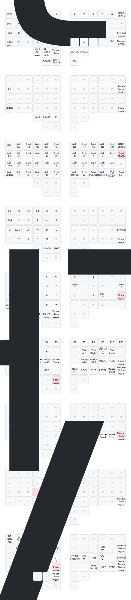

# zmk-config-charybdis-4x6-bt-focal

zmk firmware config project for charybdis 4x6 wireless based on [focal layout](https://github.com/Keyhabit/Focal-keyboard-layout) and adapted to swiss german OS keyboard layout settings.

Charybdis wireless by bastardkb: [manual](https://docs.bastardkb.com/help/bluetooth.html), [troubleshooting](https://docs.bastardkb.com/help/troubleshooting.html)

keymap for Charybdis is generated with [Keymap Editor](https://nickcoutsos.github.io/keymap-editor/)

## Building the firmware
### GitHub workflow
No need to install anything locally when you let GitHub handle the building. Find the workflow UI in the tab "Actions".

## Flashing the firmware

To flash each side of the keyboard, follow the steps below:

- Plug the right half info the computer through USB
- Double press the reset button you soldered onto the nano holder PCB
- The keyboard will mount as a removable storage device
- Copy the charybdis_right-nice_nano_v2-zmk.uf2 file into the NICENANO storage device.
- It will take a few seconds, then it will unmount and restart itself.
- Do the same with the left half, and copy the charybdis_left-nice_nano_v2-zmk.uf2 file.
- Both halves of the keyboard should now be flashed with the firmware.

## Keymaps & Layers

## Hardware / Photos

